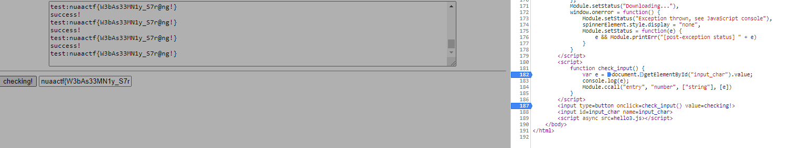
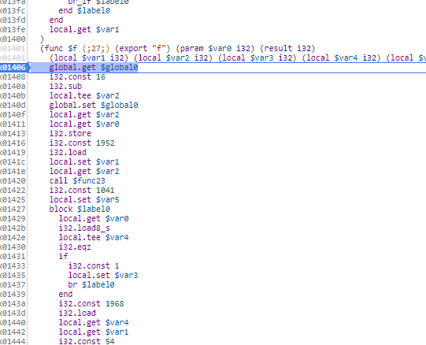

## writeup
这个题目是一个基于WebAssembly的题目，主要是想考察针对非常规平台的逆向能力

### WebAssembly
WebAssembly可以在现代的网络浏览器中运行 － 它是一种低级的类汇编语言，具有紧凑的二进制格式，可以接近原生的性能运行，并为诸如C / C ++等语言提供一个编译目标，以便它们可以在Web上运行。它也被设计为可以与JavaScript共存，允许两者一起工作。这个玩意儿的出现最初是为了支持类似在浏览器中能够执行一些较为底层的API，从而实现以一种接近原生的性能进行执行，比如页游这种比较吃性能的时候可能就会利用这类特性

### 题目分析与入口定位
这个题目可以说是完全不需要使用各种工具，只要一个浏览器即可做题。这个题目本身不是难题，首先不要被题目本身吓到。搜索wasm后缀，可以知道和webassembly相关的知识，同时运气好的话可以找到[这篇wp](https://blog.attify.com/flare-on-5-writeup-part3/)。这个题目的解决思路可以完全参照上面的思路进行。

首先我们发现，整个题目有一个输入框，输入了flag之后会判断输入的内容是否正确。明显判断逻辑就是一个js函数:
```html
<script>function check_input() { var e = document.getElementById("input_char").value; console.log(e); Module.ccall("entry", "number", ["string"], [e]) }</script>
```
可以看到，这边函数叫做entry，所以我们直接去看js文件内部:
```js
var _entry = Module["_entry"] = function() {
    return (_entry = Module["_entry"] = Module["asm"]["f"]).apply(null, arguments)
};
```
这里会发现，似乎没有找到函数调用的入口，只有一个赋值的地方？因为这边js利用了名字寻找函数，真正的函数入口点在:
```js
function ccall(ident, returnType, argTypes, args, opts) {
    var toC = {
        "string": function(str) {
            var ret = 0;
            if (str !== null && str !== undefined && str !== 0) {
                var len = (str.length << 2) + 1;
                ret = stackAlloc(len);
                stringToUTF8(str, ret, len)
            }
            return ret
        },
        "array": function(arr) {
            var ret = stackAlloc(arr.length);
            writeArrayToMemory(arr, ret);
            return ret
        }
    };

    function convertReturnValue(ret) {
        if (returnType === "string") return UTF8ToString(ret);
        if (returnType === "boolean") return Boolean(ret);
        return ret
    }
    var func = getCFunc(ident);
    var cArgs = [];
    var stack = 0;
    if (args) {
        for (var i = 0; i < args.length; i++) {
            var converter = toC[argTypes[i]];
            if (converter) {
                if (stack === 0) stack = stackSave();
                cArgs[i] = converter(args[i])
            } else {
                cArgs[i] = args[i]
            }
        }
    }
    var ret = func.apply(null, cArgs);
    ret = convertReturnValue(ret);
    if (stack !== 0) stackRestore(stack);
    return ret
}
```
于是我们尝试在这边下断点，直接跟踪动态调试:

这边调试器用的是chrome自带的f12的调试器，基本上所有的浏览器都有这个功能。之后一直动态跟踪，于是可以直接找到函数入口:


### 逆向分析
找到了入口函数，就可以开始进行逆向分析了。首先我们需要熟悉wasm的一些汇编（不过知道技巧之后可以不用了解）。
我们先来看一个官方的例子:
```
   i32.const 0
   i32.const 42
   i32.store  ;; store 42 at address 0
   i32.const 0
```
官方给出的解释是:

> 创建了两个常量值，分别为0和42，然后使用i32.store指令把给定的值存储在指定索引位置的内存对象中。同样的，该指令会把这些值出栈，所以，结果就是把42存储在内存索引0处。

在类似的字节码逆向中，都会有一个概念，叫做**运行时栈**。这个就和C中的栈类似，表示**用于临时存放一些值**。因为这类字节码**有些会直接放弃使用寄存器，转而直接使用栈来维护整个程序**，这主要是为了提高对各类平台的兼容。官方的解释是:

> 虽然浏览器把wasm编译为某种更高效的东西，但是，wasm的执行是以栈式机器定义的。也就是说，其基本理念是每种类型的指令都是在栈上执行数值的入栈出栈操作。例如，get_local被定义为把它读到的局部变量值压入到栈上，然后i32.add从栈上取出两个i32类型值（它的含义是把前面压入栈上的两个值取出来）计算它们的和（以2^32求模），最后把结果压入栈上。
正如我们的例子：我们的0和42被存放在了栈上，而store指令则表示将**栈上第一个值存放在第二个值指定的偏移处**。
相关的指令查询可以[看这里](https://github.com/sunfishcode/wasm-reference-manual/blob/master/WebAssembly.md)

有了知识储备我们回到题目中，函数开头的汇编为:
```
    global.get $global0
    i32.const 16
    i32.sub
    local.tee $var2
    global.set $global0
    local.get $var2
    local.get $var0
    i32.store
    i32.const 1952
    i32.load
    local.set $var1
```
大致翻译一下，就能得到如下的逻辑
（1）从别名$global0处获取相对应的值。此时的$global0 象征着某个偏移
（2）计算$global0-16的值，并且存放在$var2和$global0中
（3）将$var0的值存放在$var2上
（4）从偏移1952中将值取出来，存放在$var1

这一段逻辑前半段有些不太理解，不过没有关系，我们直接跟着程序来到后半段
```
i32.const 1041
    local.set $var5
    block $label0
      local.get $var0
      i32.load8_s
      local.tee $var4
      i32.eqz
      if
        i32.const 1
        local.set $var3
        br $label0
      end
      i32.const 1968
      i32.load
      local.get $var4
      local.get $var1
      i32.const 54
      i32.add
      local.tee $var4
      i32.xor
      i32.eq
```

这一段可以看出，程序会将我们输入的变量（$var4）与之前从$var1中取出来的值相加，然后异或。这里就能注意到，程序中可能存在一些比对的逻辑。顺着`i32.eq`找，大致能将整个逻辑梳理如下:
```cpp
 for(int i = 0; i < strlen(input); i++)
  {
    if(table[i] != (input[i] ^ magic ^ i))
    {
      return 0;
    }
  }
```
table就是一个在偏移1968处的table，前后文如下:
```
local.get $var9
i32.const 1968
i32.add
i32.load
```
于是最后可以写出逆向的解密脚本
```cpp
void decode()
{
  char input_test[] = {0x8,0x12,0x5,0x4,0x1,0x17,0x6,0x1a,0x39,0x5c,0xe,0x2c,0x19,0x58,0x5b,0x24,0x38,0x46,0xd,0x2a,0x21,0x44,0x2,0x31,0x10,0x18,0x5d,0x0};
  for(int i = 0; i < sizeof(input_test)/sizeof(char); i++)
  // for(int i = 0; i < strlen(flag); i++)
  {
    // printf("0x%x,", flag[i] ^ g_magic ^ i);
    printf("%c", input_test[i] ^ g_magic ^ i);
  }
}
```


